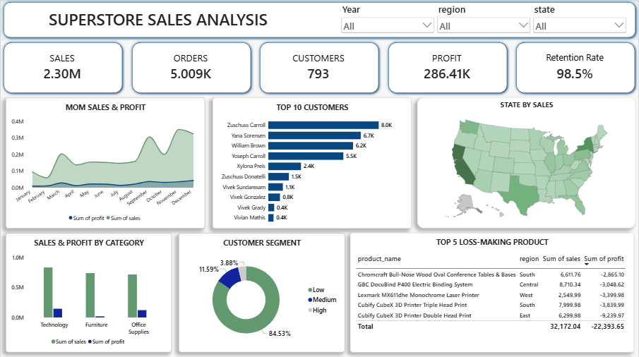

📊 Superstore Sales Analysis — Final Project

An advanced SQL and Power BI project analyzing a retail Superstore's sales, profit, and customer data — built to demonstrate real-world, interview-level data analytics skills.

📌 Objective

To perform in-depth business analysis on Superstore's transactional data, uncovering insights around sales performance, customer behavior, profitability, and growth trends — using advanced SQL techniques and an interactive Power BI dashboard.

📊 Dataset
Source: Sample Superstore Dataset (Kaggle)
Size: 9,994 rows, 21 columns (cleaned to 9,993 rows, 20 columns)
Columns: Order ID, Order Date, Ship Date, Ship Mode, Customer ID, Customer Name, Segment, Region, State, City, Category, Sub-Category, Product Name, Sales, Quantity, Discount, Profit
🛠️ Tools Used
Python (Pandas) — Data Cleaning
MySQL — Advanced SQL Analysis
Power BI — Interactive Dashboard & DAX Measures
🧹 Data Cleaning Process (Python)
Removed an unnecessary column (Row ID)
Standardized column names (lowercase, underscores)
Fixed encoding issues (used latin1 encoding)
Converted order_date and ship_date to proper datetime format
Verified zero duplicates and zero missing values in the final dataset
Pushed cleaned data directly into MySQL using SQLAlchemy
🔍 Advanced SQL Analysis — 11 Business Questions Solved
#	Question	SQL Concept Used
1	Total Sales, Total Orders, Total Profit (Net & Gross)	Aggregation, DISTINCT
2	Category-wise and Region-wise % Sales Contribution	Subquery, Percentage Calculation
3	Customer Segmentation (High/Medium/Low value)	CASE WHEN
4	Top 5 Customers per Region	Window Function — RANK() + PARTITION BY
5	Customers Spending Above Average	Nested Subquery + HAVING
6	High-Value Customers' Revenue Contribution (Pareto Analysis)	Nested Subquery
7	Month-over-Month (MoM) Sales Comparison	Window Function — LAG()
8	Year-over-Year (YoY) Growth	LAG() with Custom Offset
9	High Sales but Negative Profit Products	GROUP BY + HAVING (Multi-condition)
10	Repeat Customer Rate (Retention Analysis)	Subquery + CASE WHEN + SUM
11	Region-wise Sales Decline (YoY by Region)	LAG() + PARTITION BY
💡 Key Insights
Technology is the leading category, contributing 36.4% of total sales
West region generates the highest revenue (31.6%), while South is the weakest performer
98.49% customer retention rate — an exceptionally strong indicator of customer loyalty, with only ~1.5% one-time buyers
Revenue is highly diversified — top high-spending customers (15,000+) contribute only 2.58% of total revenue, showing the business isn't dependent on a few large customers
The Cisco TelePresence System generates high sales ($22,638) but results in an actual loss (-$1,811 profit) — a key pricing/discount strategy concern
South region experienced the sharpest year-over-year decline (-$32,485 from 2014 to 2015), while East showed consistent positive growth every year
Sales show strong seasonal spikes in March and September, followed by declines the following month
📈 Dashboard Preview

The Power BI dashboard includes:

5 KPI Cards (Sales, Orders, Customers, Profit, Retention Rate) with YoY growth indicator
Month-over-Month Sales & Profit Trend (Area Chart)
Top 10 Customers (Bar Chart)
State-wise Sales (Map)
Category-wise Sales & Profit Comparison (Bar Chart)
Customer Segmentation — High/Medium/Low (Donut Chart)
Top 5 Loss-Making Products by Region (Table)
Interactive Slicers: Year, Region, State

📁 Repository Structure
├── data_cleaning.py                    # Data cleaning & MySQL push script
├── Sample_Superstore.csv               # Raw dataset
├── cleaned_sample_superstore.csv       # Cleaned dataset
├── 01_total_sales_orders_profit.sql
├── 02_category_region_percentage.sql
├── 03_customer_segmentation.sql
├── 04_top5_customers_per_region.sql
├── 05_above_average_customers.sql
├── 06_pareto_analysis.sql
├── 07_mom_sales_comparison.sql
├── 08_yoy_growth.sql
├── 09_high_sales_negative_profit_products.sql
├── 10_retention_rate.sql
├── 11_regionwise_yoy_decline.sql
├── Superstore_Dashboard.pbix           # Power BI Dashboard file
└── README.md

